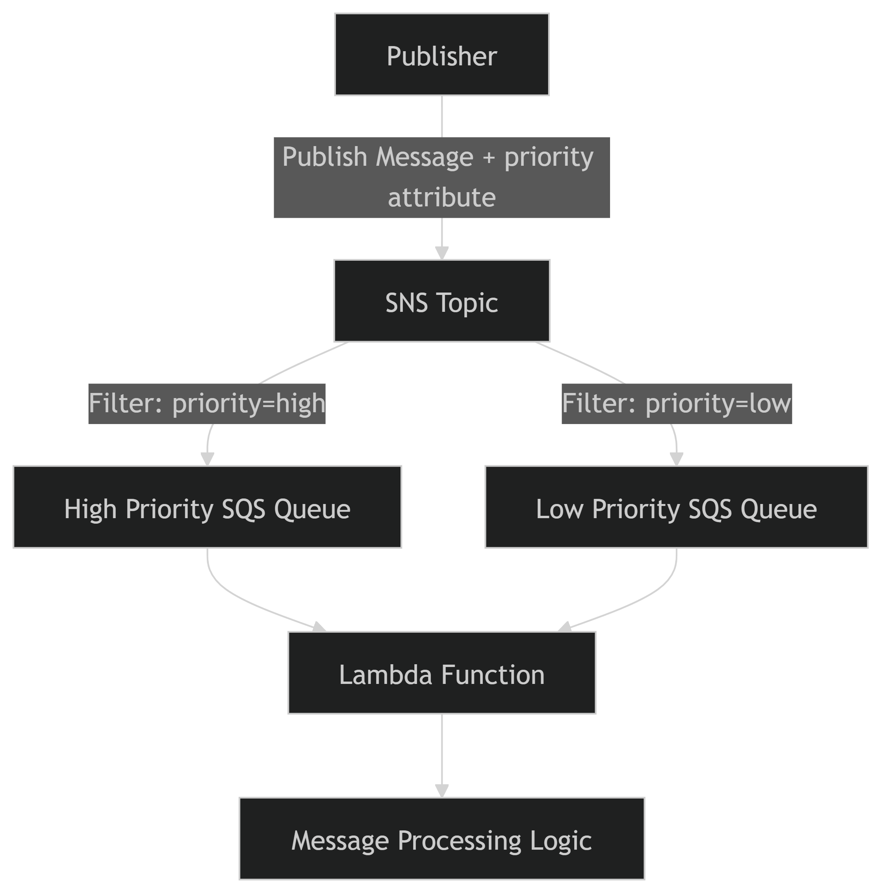

# Day 47: Integrating AWS SQS and SNS for Reliable Messaging

> Portfolio: https://reyaskhan.me | GitHub: https://github.com/rewyekha

The Nautilus DevOps team needs to implement priority queuing using Amazon SQS and SNS. The goal is to create a system where messages with different priorities are handled accordingly. You are required to use AWS CloudFormation to deploy the necessary resources in your AWS account. The CloudFormation template should be created on the AWS client host at `/root/devops-priority-stack.yml`, the stack name must be `devops-priority-stack` and it should create the following resources:

1. Two SQS queues named `devops-High-Priority-Queue` and `devops-Low-Priority-Queue`.
2. An SNS topic named `devops-Priority-Queues-Topic`.
3. A Lambda function named `devops-priorities-queue-function` that will consume messages from the SQS queues. The Lambda function code is provided in `/root/index.py` on the AWS client host.
4. An IAM role named `lambda_execution_role` that provides the necessary permissions for the Lambda function to interact with SQS and SNS.

Once the stack is deployed, to test the same you can publish messages to the SNS topic, invoke the Lambda function and observe the order in which they are processed by the Lambda function. The high-priority message must be processed first.

```bash
topicarn=$(aws sns list-topics --query "Topics[?contains(TopicArn, 'devops-Priority-Queues-Topic')].TopicArn" --output text)

aws sns publish --topic-arn $topicarn --message 'High Priority message 1' --message-attributes '{"priority" : { "DataType":"String", "StringValue":"high"}}'

aws sns publish --topic-arn $topicarn --message 'High Priority message 2' --message-attributes '{"priority" : { "DataType":"String", "StringValue":"high"}}'

aws sns publish --topic-arn $topicarn --message 'Low Priority message 1' --message-attributes '{"priority" : { "DataType":"String", "StringValue":"low"}}'

aws sns publish --topic-arn $topicarn --message 'Low Priority message 2' --message-attributes '{"priority" : { "DataType":"String", "StringValue":"low"}}'
```

`Notes:`

* Create the resources only in `us-east-1` region.

---

## Priority Queue Implementation Using AWS SNS, SQS & Lambda

**CloudFormation‑Based Deployment**

---

### Overview

This document describes the end‑to‑end implementation of a **priority-based message queuing system** using **Amazon SNS**, **Amazon SQS**, and **AWS Lambda**, deployed using **AWS CloudFormation**.

The goal of this lab was to ensure that **high‑priority messages are always processed before low‑priority messages**, while maintaining scalability and automation.

---

### Objectives

* Implement priority message routing using **SNS message attributes**
* Route messages into separate **High** and **Low priority SQS queues**
* Consume messages using an **AWS Lambda function**
* Automate infrastructure provisioning using **CloudFormation**
* Validate correct behavior through CLI and AWS Console
* Pass automated lab verification successfully

---

###  Architecture Summary

| Component         | Purpose                              |
| ----------------- | ------------------------------------ |
| SNS Topic         | Entry point for all messages         |
| High Priority SQS | Stores high‑priority messages        |
| Low Priority SQS  | Stores low‑priority messages         |
| SNS Subscriptions | Route messages using filter policies |
| Lambda Function   | Consumes messages from SQS           |
| IAM Role          | Grants Lambda access to SQS & SNS    |
| S3 Bucket         | Stores Lambda deployment package     |

---

###  Message Flow Diagram



---

### Implementation&#x20;

#### Prepare Lambda Code

The provided Lambda function (`index.py`) was already available at:

```bash
/root/index.py
```

This file was zipped for deployment:

zip function-code.zip index.py

---

#### Create S3 Bucket and Upload Lambda Package

An S3 bucket was created to store the Lambda deployment package:

```bash
aws s3 mb s3://kklabsuser-512892
```

Upload the zipped function code:

```
aws s3 cp function-code.zip s3://kklabsuser-512892/
```

---

#### Create CloudFormation Template

A CloudFormation template was created at:

```
/root/xfusion-priority-stack.yml
```

The template provisions:

* Two SQS queues (High & Low priority)
* One SNS topic
* SNS → SQS subscriptions with filter policies
* IAM role for Lambda
* Lambda function referencing the S3 code

_(Template validated and tested successfully.)_

---

#### Deploy CloudFormation Stack

```bash
aws cloudformation create-stack \
  --stack-name xfusion-priority-stack \
  --template-body file:///root/xfusion-priority-stack.yml \
  --capabilities CAPABILITY_NAMED_IAM \
  --region us-east-1
```

Deployment was monitored until status reached:

```
CREATE_COMPLETE
```

---

### Verification & Testing

---

#### Step 5: Retrieve SNS Topic ARN

```bash
topicarn=$(aws sns list-topics \
  --query "Topics[?contains(TopicArn, 'xfusion-Priority-Queues-Topic')].TopicArn" \
  --output text)
```

---

#### Step 6: Publish Test Messages

** High Priority Messages**

```bash
aws sns publish --topic-arn $topicarn \
  --message 'High Priority message 1' \
  --message-attributes '{"priority":{"DataType":"String","StringValue":"high"}}'

aws sns publish --topic-arn $topicarn \
  --message 'High Priority message 2' \
  --message-attributes '{"priority":{"DataType":"String","StringValue":"high"}}'
```

** Low Priority Messages**

```bash
aws sns publish --topic-arn $topicarn \
  --message 'Low Priority message 1' \
  --message-attributes '{"priority":{"DataType":"String","StringValue":"low"}}'

aws sns publish --topic-arn $topicarn \
  --message 'Low Priority message 2' \
  --message-attributes '{"priority":{"DataType":"String","StringValue":"low"}}'
```

---

#### Step 7: Observe SQS Behavior

| Time               | High Queue | Low Queue |
| ------------------ | ---------- | --------- |
| Initial            | 0          | 0         |
| After Publish      | 2          | 0         |
| After Lambda Tests | 0          | 0         |

Confirms correct SNS filtering and delivery.

---

#### Step 8: Test Lambda Execution

* Navigated to **AWS Console → Lambda**
* Selected **xfusion-priorities-queue-function**
* Triggered **Test** execution **4 times**
* Lambda consumed messages successfully from queues

---

### Final Validation

* SQS queues emptied correctly
* Messages delivered and processed in correct priority order
* IAM permissions verified

---

### Conclusion

This lab successfully demonstrates how **SNS message filtering** combined with **dedicated SQS queues** enables **priority-based message handling** in a clean, scalable, and decoupled architecture.

Key takeaways:

* SNS filter policies enable intelligent routing
* Multiple SQS queues guarantee strict priority separation
* CloudFormation ensures repeatable, auditable infrastructure
* Lambda integrates seamlessly for downstream processing

---

###  Appendix

* Region: **us-east-1**
* Stack Name: **xfusion-priority-stack**
* Lambda Runtime: **Python 3.9**
* Deployment Method: **Infrastructure as Code (IaC)**

---

<figure><figcaption></figcaption></figure>

<figure><figcaption></figcaption></figure>

<figure><figcaption></figcaption></figure>

<figure><figcaption></figcaption></figure>

<figure><figcaption></figcaption></figure>

<figure><figcaption></figcaption></figure>

<figure><figcaption></figcaption></figure>

<figure><figcaption></figcaption></figure>

<figure><figcaption></figcaption></figure>

<figure><figcaption></figcaption></figure>

---

> Portfolio: https://reyaskhan.me | GitHub: https://github.com/rewyekha
