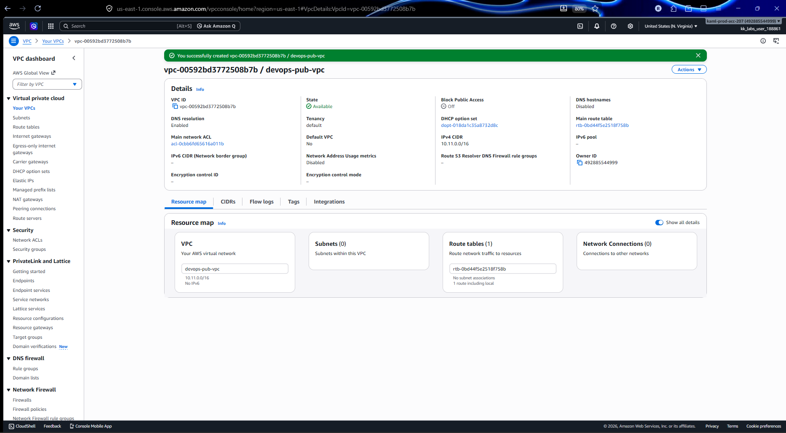

# Day 49: Centralized Audit Logging with VPC Peering

The Nautilus DevOps team needs to build a secure and scalable log aggregation setup within their AWS environment. The goal is to gather log files from an internal EC2 instance running in a private VPC, transfer them securely to another EC2 instance in a public VPC, and then push those logs to a secure S3 bucket.

1\) A VPC named `devops-priv-vpc` already exists with a private subnet named `devops-priv-subnet`, a route table named `devops-priv-rt`, and an EC2 instance named `devops-priv-ec2` (using `ubuntu` image). This instance uses the SSH key pair `devops-key.pem` already available on the AWS client host at `/root/.ssh/`.

2\) Your task is to:

* Create a new VPC named `devops-pub-vpc`.
* Create a subnet named `devops-pub-subnet` and a route table named `devops-pub-rt` under this public VPC.
* Attach an internet gateway to `devops-pub-vpc` and configure the public route table to enable internet access.
* Launch an EC2 instance named `devops-pub-ec2` into the public subnet using the same key pair as the private instance.
* Create an IAM role named `devops-s3-role` with `PutObject` permission to an S3 bucket and attach it to the public EC2 instance.
* Create a new private S3 bucket named `devops-s3-logs-14133`.
* Configure a VPC Peering named `devops-vpc-peering` between the private and public VPCs.
* Modify both `devops-priv-rt` and `devops-pub-rt` to route each other's CIDR blocks through the peering connection.
* On the private instance, configure a cron job to push the `/var/log/boots.log` file to the public instance (using `scp` or `rsync`).
* On the public instance, configure a cron job to push that same file to the created S3 bucket.
* The uploaded file must be stored in the S3 bucket under the path `devops-priv-vpc/boot/boots.log`.

\
`Notes:`

* Create the resources only in `us-east-1` region.


## AWS Datacenter Log Aggregation Setup

***

### Overview

This document covers the end-to-end setup of a secure log aggregation pipeline on AWS. The goal was to:

* Collect logs from a private EC2 instance (`datacenter-priv-ec2`) inside a private VPC
* Transfer them securely to a public EC2 instance (`datacenter-pub-ec2`) via SCP over VPC Peering
* Push those logs from the public EC2 to a private S3 bucket using an IAM role

The pipeline runs automatically every minute via cron jobs on both EC2 instances.

***

### Architecture

```bash
┌──────────────────────────────────┐         ┌──────────────────────────────────────┐
│   datacenter-priv-vpc            │         │   datacenter-pub-vpc                 │
│   10.10.0.0/16                   │         │   10.20.0.0/16                       │
│                                  │         │                                      │
│  ┌─────────────────────────┐     │         │  ┌──────────────────────────────┐   │
│  │  datacenter-priv-ec2    │     │VPC      │  │  datacenter-pub-ec2          │   │
│  │  10.10.1.194 (Ubuntu)   │─────┼─Peering─┼──│  10.20.1.102 (Amazon Linux) │   │
│  │  /var/log/boots.log     │     │         │  │  /home/ec2-user/boots.log    │   │
│  └─────────────────────────┘     │         │  └──────────┬───────────────────┘   │
│                                  │         │             │ IAM Role               │
│  datacenter-priv-rt              │         │             │ AmazonS3FullAccess     │
│  datacenter-priv-subnet          │         │  datacenter-pub-rt                  │
│                                  │         │  datacenter-pub-subnet              │
└──────────────────────────────────┘         │  datacenter-pub-igw                 │
                                             └──────────────┬───────────────────────┘
                                                            │
                                                            ▼
                                             ┌──────────────────────────────────┐
                                             │  S3: datacenter-s3-logs-30900    │
                                             │  datacenter-priv-vpc/boot/       │
                                             │  boots.log                       │
                                             └──────────────────────────────────┘
```

***

### Prerequisites

* AWS CLI configured on the `aws-client` host
* SSH key pair `datacenter-key.pem` available at `/root/.ssh/`
* Existing private VPC named `datacenter-priv-vpc` with:
  * Private subnet: `datacenter-priv-subnet`
  * Route table: `datacenter-priv-rt`
  * EC2 instance: `datacenter-priv-ec2` (Ubuntu 20.04)

***

### Step 1 — Discover Existing Private VPC

Retrieve the existing private VPC details and store them in environment variables for use throughout the lab.

```bash
PRIV_VPC_ID=$(aws ec2 describe-vpcs \
  --filters "Name=tag:Name,Values=datacenter-priv-vpc" \
  --query "Vpcs[0].VpcId" \
  --output text)

PRIV_CIDR=$(aws ec2 describe-vpcs \
  --filters "Name=tag:Name,Values=datacenter-priv-vpc" \
  --query "Vpcs[0].CidrBlock" \
  --output text)

echo "Private VPC: $PRIV_VPC_ID | CIDR: $PRIV_CIDR"
```

**Output:**

```
Private VPC: vpc-010c2c8253302b2a4 | CIDR: 10.10.0.0/16
```

***

### Step 2 — Create Public VPC and Networking

#### 2.1 Create the Public VPC

```bash
PUB_VPC_ID=$(aws ec2 create-vpc \
  --cidr-block 10.20.0.0/16 \
  --tag-specifications 'ResourceType=vpc,Tags=[{Key=Name,Value=datacenter-pub-vpc}]' \
  --query "Vpc.VpcId" \
  --output text)

echo "Public VPC: $PUB_VPC_ID"
```

**Output:**

```
Public VPC: vpc-0d74943b455ccff38
```

#### 2.2 Create the Public Subnet

```bash
PUB_SUBNET_ID=$(aws ec2 create-subnet \
  --vpc-id $PUB_VPC_ID \
  --cidr-block 10.20.1.0/24 \
  --availability-zone us-east-1a \
  --tag-specifications 'ResourceType=subnet,Tags=[{Key=Name,Value=datacenter-pub-subnet}]' \
  --query "Subnet.SubnetId" \
  --output text)

echo "Subnet: $PUB_SUBNET_ID"
```

**Output:**

```
Subnet: subnet-063462c5eb81e65b6
```

#### 2.3 Create the Public Route Table

```bash
PUB_RT_ID=$(aws ec2 create-route-table \
  --vpc-id $PUB_VPC_ID \
  --tag-specifications 'ResourceType=route-table,Tags=[{Key=Name,Value=datacenter-pub-rt}]' \
  --query "RouteTable.RouteTableId" \
  --output text)

echo "Route Table: $PUB_RT_ID"
```

**Output:**

```
Route Table: rtb-0c64b57b0bae042f9
```

#### 2.4 Create and Attach Internet Gateway

```bash
IGW_ID=$(aws ec2 create-internet-gateway \
  --tag-specifications 'ResourceType=internet-gateway,Tags=[{Key=Name,Value=datacenter-pub-igw}]' \
  --query "InternetGateway.InternetGatewayId" \
  --output text)

echo "IGW: $IGW_ID"

aws ec2 attach-internet-gateway \
  --internet-gateway-id $IGW_ID \
  --vpc-id $PUB_VPC_ID
```

**Output:**

```
IGW: igw-027c62a9297cc0321
```

#### 2.5 Add Default Route and Associate Subnet

```bash
aws ec2 create-route \
  --route-table-id $PUB_RT_ID \
  --destination-cidr-block 0.0.0.0/0 \
  --gateway-id $IGW_ID

aws ec2 associate-route-table \
  --subnet-id $PUB_SUBNET_ID \
  --route-table-id $PUB_RT_ID
```

**Output:**

```json
{ "Return": true }
{
    "AssociationId": "rtbassoc-0186fbefa0abb9881",
    "AssociationState": { "State": "associated" }
}
```

***

### Step 3 — Launch Public EC2 Instance

```bash
PUB_EC2_ID=$(aws ec2 run-instances \
  --image-id ami-0c02fb55956c7d316 \
  --instance-type t2.micro \
  --key-name datacenter-key \
  --subnet-id $PUB_SUBNET_ID \
  --associate-public-ip-address \
  --tag-specifications 'ResourceType=instance,Tags=[{Key=Name,Value=datacenter-pub-ec2}]' \
  --query "Instances[0].InstanceId" \
  --output text)

echo "Public EC2: $PUB_EC2_ID"
```

**Output:**

```
Public EC2: i-0e8661a9e05ba1565
```

***

### Step 4 — Create S3 Bucket

```bash
aws s3api create-bucket \
  --bucket datacenter-s3-logs-30900 \
  --region us-east-1
```

**Output:**

```json
{
    "Location": "/datacenter-s3-logs-30900",
    "BucketArn": "arn:aws:s3:::datacenter-s3-logs-30900"
}
```

***

### Step 5 — Configure VPC Peering

#### 5.1 Create and Accept Peering Connection

```bash
PEERING_ID=$(aws ec2 create-vpc-peering-connection \
  --vpc-id $PUB_VPC_ID \
  --peer-vpc-id $PRIV_VPC_ID \
  --tag-specifications 'ResourceType=vpc-peering-connection,Tags=[{Key=Name,Value=datacenter-vpc-peering}]' \
  --query "VpcPeeringConnection.VpcPeeringConnectionId" \
  --output text)

echo "Peering: $PEERING_ID"

aws ec2 accept-vpc-peering-connection \
  --vpc-peering-connection-id $PEERING_ID
```

**Output:**

```
Peering: pcx-0028d969616ef9311
```

#### 5.2 Add Routes in Both Route Tables

```bash
# Public RT → Private VPC
aws ec2 create-route \
  --route-table-id $PUB_RT_ID \
  --destination-cidr-block $PRIV_CIDR \
  --vpc-peering-connection-id $PEERING_ID

# Private RT → Public VPC (see Issue #3 for the correction needed here)
aws ec2 create-route \
  --route-table-id $CORRECT_PRIV_RT \
  --destination-cidr-block 10.20.0.0/16 \
  --vpc-peering-connection-id $PEERING_ID
```

**Output:**

```json
{ "Return": true }
{ "Return": true }
```

#### 5.3 Verified Route Tables After Fix

**Private RT (`datacenter-priv-rt`):**

```
+-----------------------+------------+--------------------+---------+
| DestinationCidrBlock  | GatewayId  |      Origin        |  State  |
+-----------------------+------------+--------------------+---------+
|  10.10.0.0/16         |  local     |  CreateRouteTable  |  active |
|  10.20.0.0/16         |            |  CreateRoute       |  active |
+-----------------------+------------+--------------------+---------+
```

**Public RT (`datacenter-pub-rt`):**

```
+----------------------+------------------------+-------------------+----------+
| DestinationCidrBlock |       GatewayId        |      Origin       |  State   |
+----------------------+------------------------+-------------------+----------+
|  10.10.0.0/16        |                        |  CreateRoute      |  active  |
|  10.20.0.0/16        |  local                 |  CreateRouteTable |  active  |
|  0.0.0.0/0           |  igw-027c62a9297cc0321 |  CreateRoute      |  active  |
+----------------------+------------------------+-------------------+----------+
```

***

### Step 6 — IAM Role and Instance Profile

#### 6.1 Create IAM Role

```bash
cat <<EOF > trust.json
{
  "Version": "2012-10-17",
  "Statement": [
    {
      "Effect": "Allow",
      "Principal": { "Service": "ec2.amazonaws.com" },
      "Action": "sts:AssumeRole"
    }
  ]
}
EOF

ROLE_NAME="datacenter-s3-role"

aws iam create-role \
  --role-name $ROLE_NAME \
  --assume-role-policy-document file://trust.json
```

**Output:**

```json
{
    "Role": {
        "RoleName": "datacenter-s3-role",
        "RoleId": "AROASAMDSHFLGN4YLCNZK",
        "Arn": "arn:aws:iam::138251745622:role/datacenter-s3-role"
    }
}
```

#### 6.2 Attach S3 Policy

> **Note:** `iam:PutRolePolicy` was denied for the lab user. Used `AttachRolePolicy` with an AWS managed policy instead.

```bash
aws iam attach-role-policy \
  --role-name $ROLE_NAME \
  --policy-arn arn:aws:iam::aws:policy/AmazonS3FullAccess
```

#### 6.3 Create Instance Profile and Attach to EC2

```bash
PROFILE_NAME="datacenter-profile"

aws iam create-instance-profile \
  --instance-profile-name $PROFILE_NAME

aws iam add-role-to-instance-profile \
  --instance-profile-name $PROFILE_NAME \
  --role-name $ROLE_NAME

aws ec2 associate-iam-instance-profile \
  --instance-id $PUB_EC2_ID \
  --iam-instance-profile Name=$PROFILE_NAME
```

**Verify association:**

```bash
aws ec2 describe-iam-instance-profile-associations \
  --query "IamInstanceProfileAssociations[].{Instance:InstanceId,State:State}" \
  --output table
```

**Output:**

```
+----------------------+--------------+
|       Instance       |    State     |
+----------------------+--------------+
|  i-0e8661a9e05ba1565 |  associated  |
+----------------------+--------------+
```

***

### Step 7 — Establish SSH Connectivity

#### 7.1 Get Instance IPs

```bash
PUB_IP=$(aws ec2 describe-instances \
  --instance-ids $PUB_EC2_ID \
  --query "Reservations[0].Instances[0].PublicIpAddress" \
  --output text)

PRIV_EC2_ID=$(aws ec2 describe-instances \
  --filters "Name=tag:Name,Values=datacenter-priv-ec2" \
  --query "Reservations[0].Instances[0].InstanceId" \
  --output text)

PRIV_IP=$(aws ec2 describe-instances \
  --instance-ids $PRIV_EC2_ID \
  --query "Reservations[0].Instances[0].PrivateIpAddress" \
  --output text)

echo "Public IP: $PUB_IP"
echo "Private IP: $PRIV_IP"
```

**Output:**

```
Public IP: 54.235.40.68
Private IP: 10.10.1.194
```

#### 7.2 Open SSH on Public EC2 Security Group

```bash
PUB_SG=$(aws ec2 describe-instances \
  --instance-ids $PUB_EC2_ID \
  --query "Reservations[0].Instances[0].SecurityGroups[0].GroupId" \
  --output text)

aws ec2 authorize-security-group-ingress \
  --group-id $PUB_SG \
  --protocol tcp \
  --port 22 \
  --cidr 0.0.0.0/0
```

#### 7.3 Open SSH on Private EC2 Security Group

```bash
PRIV_SG=$(aws ec2 describe-instances \
  --instance-ids $PRIV_EC2_ID \
  --query "Reservations[0].Instances[0].SecurityGroups[0].GroupId" \
  --output text)

aws ec2 authorize-security-group-ingress \
  --group-id $PRIV_SG \
  --protocol tcp \
  --port 22 \
  --cidr 10.20.0.0/16

aws ec2 authorize-security-group-ingress \
  --group-id $PRIV_SG \
  --protocol icmp \
  --port -1 \
  --cidr 10.20.0.0/16
```

#### 7.4 Copy SSH Key to Public EC2

```bash
chmod 400 /root/.ssh/datacenter-key.pem

scp -i /root/.ssh/datacenter-key.pem \
  /root/.ssh/datacenter-key.pem \
  ec2-user@$PUB_IP:/home/ec2-user/
```

#### 7.5 SSH into Public EC2 and Test Peering Connectivity

```bash
ssh -i /root/.ssh/datacenter-key.pem ec2-user@$PUB_IP
```

Inside public EC2:

```bash
ping -c 3 10.10.1.194
```

**Output (after route fix):**

```
64 bytes from 10.10.1.194: icmp_seq=1 ttl=64 time=0.468 ms
64 bytes from 10.10.1.194: icmp_seq=2 ttl=64 time=0.498 ms
64 bytes from 10.10.1.194: icmp_seq=3 ttl=64 time=0.462 ms
3 packets transmitted, 3 received, 0% packet loss
```

#### 7.6 Copy Key to Private EC2 and Verify

From public EC2:

```bash
scp -i /home/ec2-user/datacenter-key.pem \
  -o StrictHostKeyChecking=no \
  /home/ec2-user/datacenter-key.pem \
  ubuntu@10.10.1.194:/home/ubuntu/datacenter-key.pem

ssh -i /home/ec2-user/datacenter-key.pem \
  -o StrictHostKeyChecking=no \
  ubuntu@10.10.1.194 "ls -la /home/ubuntu/datacenter-key.pem"
```

**Output:**

```
-r-------- 1 ubuntu ubuntu 1675 May  2 09:00 /home/ubuntu/datacenter-key.pem
```

***

### Step 8 — Configure Cron Jobs

#### 8.1 Verify Log File on Private EC2

```bash
ssh -i /home/ec2-user/datacenter-key.pem \
  -o StrictHostKeyChecking=no \
  ubuntu@10.10.1.194 "ls /var/log/boot*"
```

**Output:**

```
/var/log/boots.log
```

> **Important:** The file is named `boots.log` (not `boot.log`). This was a key discovery — the cron was initially set up with the wrong filename.

#### 8.2 Set Up Cron on Private EC2

Run from public EC2 using heredoc:

```bash
ssh -i /home/ec2-user/datacenter-key.pem \
  -o StrictHostKeyChecking=no ubuntu@10.10.1.194 << 'EOF'
chmod 400 /home/ubuntu/datacenter-key.pem
(crontab -l 2>/dev/null; echo "* * * * * scp -i /home/ubuntu/datacenter-key.pem -o StrictHostKeyChecking=no /var/log/boots.log ec2-user@10.20.1.102:/home/ec2-user/boots.log") | crontab -
crontab -l
EOF
```

**Output:**

```
* * * * * scp -i /home/ubuntu/datacenter-key.pem -o StrictHostKeyChecking=no /var/log/boots.log ec2-user@10.20.1.102:/home/ec2-user/boots.log
```

#### 8.3 Test SCP Manually

```bash
ssh -i /home/ec2-user/datacenter-key.pem \
  -o StrictHostKeyChecking=no ubuntu@10.10.1.194 \
  "scp -i /home/ubuntu/datacenter-key.pem -o StrictHostKeyChecking=no \
  /var/log/boots.log ec2-user@10.20.1.102:/home/ec2-user/boots.log"

ls -la /home/ec2-user/boots.log
```

**Output:**

```
-rw-r--r-- 1 ec2-user ec2-user 27 May  2 09:04 /home/ec2-user/boots.log
```

#### 8.4 Set Up Cron on Public EC2

```bash
(crontab -l 2>/dev/null; echo "* * * * * aws s3 cp /home/ec2-user/boots.log s3://datacenter-s3-logs-30900/datacenter-priv-vpc/boot/boots.log") | crontab -

crontab -l
```

**Output:**

```
* * * * * aws s3 cp /home/ec2-user/boots.log s3://datacenter-s3-logs-30900/datacenter-priv-vpc/boot/boots.log
```

***

### Step 9 — Verify S3 Upload

#### 9.1 Manual Upload Test

```bash
aws s3 cp /home/ec2-user/boots.log \
  s3://datacenter-s3-logs-30900/datacenter-priv-vpc/boot/boots.log
```

**Output:**

```
upload: ./boots.log to s3://datacenter-s3-logs-30900/datacenter-priv-vpc/boot/boots.log
```

#### 9.2 Confirm File in S3

```bash
aws s3 ls s3://datacenter-s3-logs-30900/datacenter-priv-vpc/boot/
```

**Output:**

```
2026-05-02 09:05:02         27 boots.log
```

✅ **Lab complete** — `boots.log` is successfully stored at `s3://datacenter-s3-logs-30900/datacenter-priv-vpc/boot/boots.log` and both cron jobs run every minute automatically.

***

### Issues Encountered and Resolutions

#### Issue #1 — Using CIDR instead of VPC ID for subnet creation

**Error:**

```
An error occurred (InvalidVpcID.NotFound) when calling the CreateSubnet operation:
The vpc ID '10.20.0.0/16' does not exist
```

**Cause:** The `--vpc-id` flag requires a VPC ID (`vpc-xxxxxxxx`), not a CIDR block. The CIDR was passed by mistake after a failed variable substitution.

**Fix:** Stored the VPC ID in a variable using `--output text` and referenced `$PUB_VPC_ID`:

```bash
PUB_VPC_ID=$(aws ec2 create-vpc \
  --cidr-block 10.20.0.0/16 \
  --query "Vpc.VpcId" \
  --output text)
```

***

#### Issue #2 — `iam:PutRolePolicy` Access Denied

**Error:**

```
An error occurred (AccessDenied) when calling the PutRolePolicy operation:
User: arn:aws:iam::138251745622:user/kk_labs_user_170641 is not authorized
to perform: iam:PutRolePolicy on resource: role datacenter-s3-role
```

**Cause:** The lab IAM user did not have permission to create inline role policies.

**Fix:** Used `attach-role-policy` with a managed policy instead:

```bash
aws iam attach-role-policy \
  --role-name datacenter-s3-role \
  --policy-arn arn:aws:iam::aws:policy/AmazonS3FullAccess
```

Also attempted `AmazonS3PutObject` which does not exist as a managed policy:

```
An error occurred (NoSuchEntity): Policy arn:aws:iam::aws:policy/AmazonS3PutObject
does not exist or is not attachable.
```

***

#### Issue #3 — SSH to Public EC2 Failing (Wrong Username)

**Error:**

```
ubuntu@54.235.40.68: Permission denied (publickey,gssapi-keyex,gssapi-with-mic).
```

**Cause:** The public EC2 was launched with `ami-0c02fb55956c7d316` which is **Amazon Linux 2**, not Ubuntu. The default user for Amazon Linux 2 is `ec2-user`, not `ubuntu`.

**Fix:**

```bash
ssh -i /root/.ssh/datacenter-key.pem ec2-user@$PUB_IP
```

***

#### Issue #4 — VPC Peering Route Added to Wrong Route Table (Root Cause of SSH Timeout)

**Symptom:** 100% packet loss when pinging `10.10.1.194` from the public EC2, even though:

* VPC Peering was active
* Security group rules were correct
* Both route tables appeared to have routes

**Cause:** The private VPC had **two route tables**:

* `rtb-08dbc667eb724c96e` — the **main/default** route table (not associated with any subnet explicitly)
* `rtb-0a2fe07a0806e9e80` — `datacenter-priv-rt`, the **explicit** route table associated with `subnet-020ef2d523c80dc6d`

The peering route (`10.20.0.0/16`) was added to the **main route table**, not to `datacenter-priv-rt`. Since the private EC2's subnet uses the explicit route table, traffic had no route back to the public VPC.

**Discovery:**

```bash
aws ec2 describe-route-tables \
  --filters "Name=vpc-id,Values=$PRIV_VPC_ID" \
  --query "RouteTables[].{Id:RouteTableId,Name:Tags[?Key=='Name']|[0].Value,Main:Associations[0].Main,SubnetId:Associations[0].SubnetId}" \
  --output table
```

```
+------------------------+--------+----------------------+---------------------------+
|  rtb-08dbc667eb724c96e | True   |  None                |  None                     |
|  rtb-0a2fe07a0806e9e80 | False  |  datacenter-priv-rt  |  subnet-020ef2d523c80dc6d |
+------------------------+--------+----------------------+---------------------------+
```

**Fix:** Added the peering route to the correct route table:

```bash
CORRECT_PRIV_RT=$(aws ec2 describe-route-tables \
  --filters "Name=association.subnet-id,Values=$PRIV_SUBNET_ID" \
  --query "RouteTables[0].RouteTableId" \
  --output text)

aws ec2 create-route \
  --route-table-id $CORRECT_PRIV_RT \
  --destination-cidr-block 10.20.0.0/16 \
  --vpc-peering-connection-id $PEERING_ID
```

***

#### Issue #5 — Cross-VPC Security Group Reference

**Attempted:**

```bash
aws ec2 authorize-security-group-ingress \
  --group-id $PRIV_SG \
  --protocol tcp \
  --port 22 \
  --source-group $PUB_SG
```

**Observation:** While AWS accepted this rule (peering status showed `active`), it is unreliable for connectivity purposes across VPC peering. The CIDR-based rule (`10.20.0.0/16`) is the correct and reliable approach.

**Fix:** Kept the CIDR-based rule and confirmed it was already in place:

```bash
aws ec2 authorize-security-group-ingress \
  --group-id $PRIV_SG \
  --protocol tcp \
  --port 22 \
  --cidr 10.20.0.0/16
```

***

#### Issue #6 — SCP from Inside Private EC2 Failing (No Key Available)

**Error (run from inside private EC2):**

```
Warning: Identity file /home/ec2-user/datacenter-key.pem not accessible: No such file or directory.
ubuntu@10.10.1.194: Permission denied (publickey).
```

**Cause:** The SSH key existed on the public EC2 at `/home/ec2-user/datacenter-key.pem`, not on the private EC2. After SSHing into the private EC2 and trying to SCP using that path, the key was not accessible because it was referencing a path on the public EC2.

**Fix:** Exit back to the public EC2 and SCP the key **to** the private EC2 first:

```bash
# Run from public EC2
scp -i /home/ec2-user/datacenter-key.pem \
  -o StrictHostKeyChecking=no \
  /home/ec2-user/datacenter-key.pem \
  ubuntu@10.10.1.194:/home/ubuntu/datacenter-key.pem
```

***

#### Issue #7 — Cron Using Wrong Log Filename

**Initial cron (wrong):**

```
* * * * * scp ... /var/log/boot.log ec2-user@10.20.1.102:/home/ec2-user/boots.log
```

**Cause:** Assumed the log file was `boot.log` (standard Linux name) without verifying. The actual file on the Ubuntu private EC2 was `boots.log`.

**Discovery:**

```bash
ssh ... ubuntu@10.10.1.194 "ls /var/log/boot*"
# Output: /var/log/boots.log
```

**Fix:** Removed the wrong cron and added the correct one:

```bash
ssh -i /home/ec2-user/datacenter-key.pem -o StrictHostKeyChecking=no ubuntu@10.10.1.194 << 'EOF'
crontab -r
(crontab -l 2>/dev/null; echo "* * * * * scp -i /home/ubuntu/datacenter-key.pem -o StrictHostKeyChecking=no /var/log/boots.log ec2-user@10.20.1.102:/home/ec2-user/boots.log") | crontab -
EOF
```

***

### Final Resource Summary

| Resource           | Name                     | ID/Value                                                      |
| ------------------ | ------------------------ | ------------------------------------------------------------- |
| Private VPC        | datacenter-priv-vpc      | vpc-010c2c8253302b2a4                                         |
| Public VPC         | datacenter-pub-vpc       | vpc-0d74943b455ccff38                                         |
| Public Subnet      | datacenter-pub-subnet    | subnet-063462c5eb81e65b6                                      |
| Public Route Table | datacenter-pub-rt        | rtb-0c64b57b0bae042f9                                         |
| Internet Gateway   | datacenter-pub-igw       | igw-027c62a9297cc0321                                         |
| Public EC2         | datacenter-pub-ec2       | i-0e8661a9e05ba1565                                           |
| Private EC2        | datacenter-priv-ec2      | i-012f9b04cc988d120                                           |
| VPC Peering        | datacenter-vpc-peering   | pcx-0028d969616ef9311                                         |
| S3 Bucket          | datacenter-s3-logs-30900 | arn:aws:s3:::datacenter-s3-logs-30900                         |
| IAM Role           | datacenter-s3-role       | arn:aws:iam::138251745622:role/datacenter-s3-role             |
| Instance Profile   | datacenter-profile       | arn:aws:iam::138251745622:instance-profile/datacenter-profile |

#### Cron Jobs

**Private EC2 (`ubuntu@10.10.1.194`):**

```
* * * * * scp -i /home/ubuntu/datacenter-key.pem -o StrictHostKeyChecking=no /var/log/boots.log ec2-user@10.20.1.102:/home/ec2-user/boots.log
```

**Public EC2 (`ec2-user@10.20.1.102`):**

```
* * * * * aws s3 cp /home/ec2-user/boots.log s3://datacenter-s3-logs-30900/datacenter-priv-vpc/boot/boots.log
```

#### S3 Final Verification

```
2026-05-02 09:05:02    27    s3://datacenter-s3-logs-30900/datacenter-priv-vpc/boot/boots.log
```

<figure><figcaption></figcaption></figure>

<figure><figcaption></figcaption></figure>

<figure><figcaption></figcaption></figure>

<figure><figcaption></figcaption></figure>

<figure><figcaption></figcaption></figure>

<figure><figcaption></figcaption></figure>

<figure><figcaption></figcaption></figure>

<figure><figcaption></figcaption></figure>

<figure><figcaption></figcaption></figure>

<figure><figcaption></figcaption></figure>

<figure><figcaption></figcaption></figure>

<figure><figcaption></figcaption></figure>
